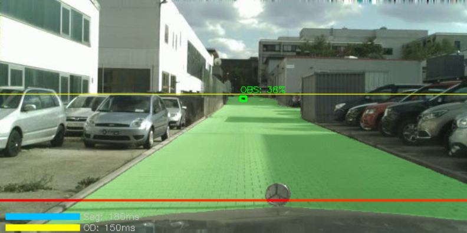
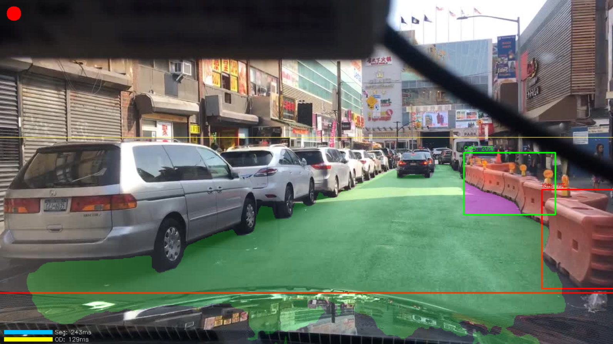
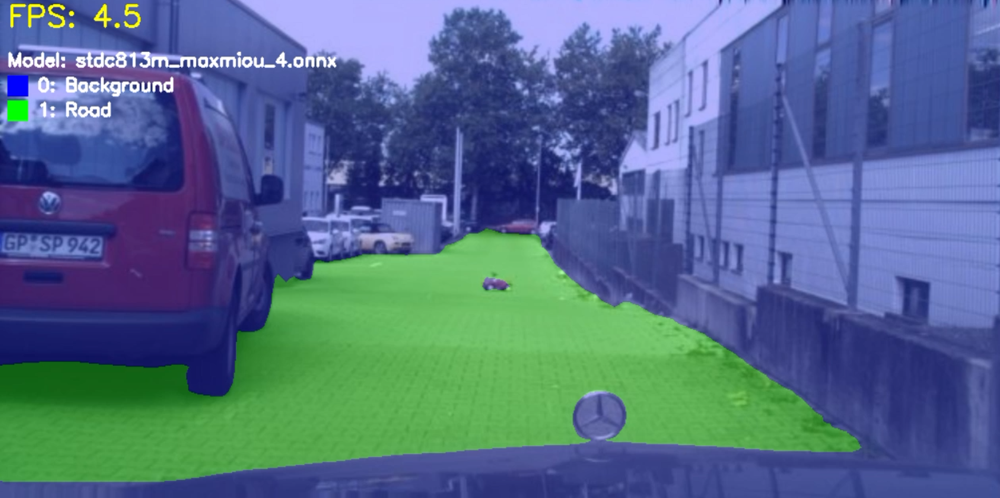
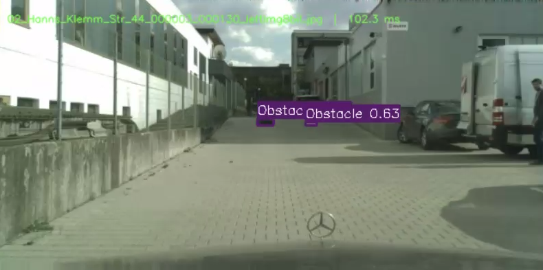
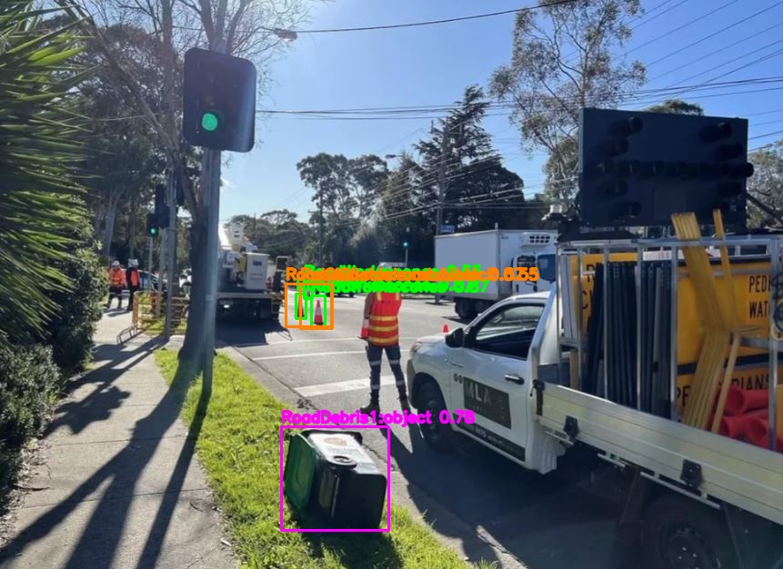
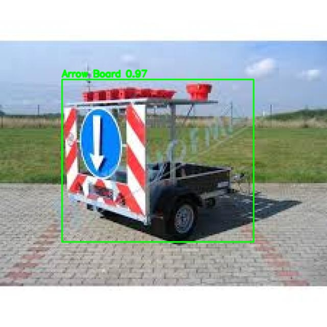
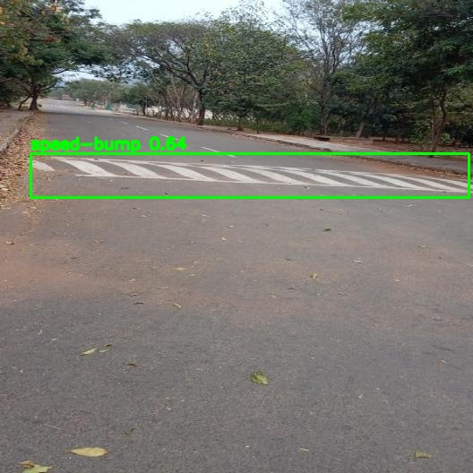
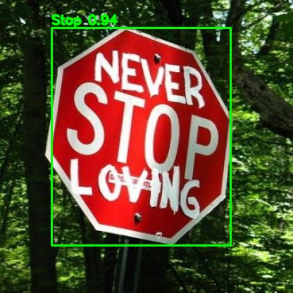

# Vehicle Embedded Obstacle Detection

## Project Overview

This project implements a decentralized, crowd-sourced road safety system similar to Waze, but automated. The goal is to detect hazardous road obstacles (debris, fallen logs, rocks) using on-device computer vision in real-time.

This repository focuses on the **Embedded Detection Module**: a lightweight, power-optimized system running inside the vehicle. It processes a video stream to filter out "normal" scenery and flags only frames containing verified obstacles hindering the drivable path. These positive candidates are transmitted to a remote server for stereo-depth analysis and database updates.

## Team

- **Arezki Haddouche**: Depth Estimation, Connectivity (GPS/4G).

- **Massyl Adjal**: Embedded AI, Computer Vision, Model Optimization.

- **Ghiles Redjdal**: Backend Development, Cloud AI Analysis.

- **Imad Bafou**: Database Management,  Documentation.

- **Raid Benoudina**: Android Application, User Interface. 

## Architecture

The system operates on a client-server model:

1. **Client (Vehicle)**: Captures video and runs lightweight AI models to detect anomalies on the road surface. Only relevant data is uploaded.

2. **Server (Cloud)**: Receives flagged frames, performs heavy computation (Stereo Depth Estimation, Traffic Impact Analysis), and updates the central database.

3. **User (App)**: Drivers receive real-time alerts about verified obstacles on their route.

## First module : AI Embeded detection, GPS and Connectivity

### Key Technical Contributions

- **Hybrid Model Architecture**: Implemented a dual-model pipeline combining Semantic Segmentation (STDC813M) and Object Detection (YOLOv8s).

- **Geometric Sensor Fusion**: Developed a custom algorithm to aggregate model outputs, filtering false positives (e.g., pedestrians on sidewalks) by calculating the Intersection over Area (IoA) between the detected object and the road mask.

- **Edge Optimization**: Quantized models from FP32 to INT8 using the Hailo Dataflow Compiler, achieving real-time performance on a Raspberry Pi 5 with a 13 TOPS AI HAT.

- **Dataset Engineering**: Curated a custom "Super Dataset" merging Imad's dataset and LostAndFound to correct class imbalances and improve recall on atypical road hazards.

### Module Architecture

#### 1. Hardware Specifications

- **Host**: Raspberry Pi 5 (8 GB RAM)

- **Accelerator**: Hailo-8L AI HAT (13 TOPS, PCIe Gen 3)

- **Sensors**: U-blox GPS (NMEA Sync), Dual Camera (Stereo Capture)

- **Constraints**: High Obstacle Variety, Low latency, strict memory budget, optimized power consumption.

#### 2. The AI Pipeline

The detection logic follows a strict "Filter-then-Flag" approach to minimize bandwidth usage.

1. **Input**: 640x320 video stream.

2. **Semantic Segmentation (STDC813M)**: Generates a binary mask of the drivable road surface. Optimized for speed using the STDC (Short-Term Dense Concatenate) backbone.

3. **Object Detection (YOLOv8s)**: Detects potential hazards. Fine-tuned on a custom dataset excluding common traffic objects (cars, signs) to focus on anomalies.

4. **Geometric Fusion (The "Handshake")**:
   
   - Projects the bounding box of the detected object onto the segmentation mask.
   
   - Calculates the overlap percentage.
   
   - **Decision Rule**: If `Overlap > Threshold` and `Cooldown > 5s`, the frame is flagged as a valid hazard.

5. **Output**: Triggers the GPS/Stereo capture routine and saves metadata for transmission.

### Performance & Results

#### Model Evaluation

| **Model**               | **Metric** | **Score** | **Notes**                                     |
| ----------------------- | ---------- | --------- | --------------------------------------------- |
| **Segmentation (STDC)** | mIoU@50    | **0.95**  | Fine-tuned on Cityscapes (Road vs Background) |
| **Detection (YOLOv8s)** | mAP@50     | **0.68**  | Custom Dataset (High recall on small debris)  |

#### Visual Demonstrations

**1. Geometric Fusion in Action**

  
  

*The green bounding box indicates a valid detection overlapping significantly with the road mask. The system successfully ignores objects outside the drivable area.*

**2. On-Device Quantized Inference**

  
  

*Left: STDC813M Segmentation (INT8). Right: YOLOv8s Detection (INT8).*

### Development Workflow

#### Training & Fine-tuning

Models were trained on an NVIDIA GPU cluster using PyTorch.

- **Segmentation**: Trained on Cityscapes using a simplified 2-class structure (Road/Background) to maximize mIoU.

- **Detection**: Trained on a merged dataset (Imad + LostAndFound) to resolve class imbalance issues found in standard datasets like COCO or BDD100K.

#### Deployment (Quantization)

Conversion from PyTorch (`.pt`) to Hailo Executable Format (`.hef`):

1. **Export**: PyTorch $\rightarrow$ ONNX (Opset 11).

2. **Calibration**: Post-Training Quantization (PTQ) using 1024 representative images to map FP32 weights to INT8 dynamic ranges.

3. **Compilation**: Using Hailo Dataflow Compiler for graph optimization and resource allocation.

## Second Module : Cloud AI and Depth Analysis
## Second Module: Cloud AI Analysis & Model Specialization

This module acts as the high-performance validation engine. It processes flagged data from the vehicles using specialized server-side models to ensure maximum detection reliability.

### Key Technical Contributions (Ghiles Redjdal)

- **Backend Infrastructure**: Built the server-side pipeline to receive, manage, and store hazard data transmitted from the embedded units.
- **Server-Side Validation**: Implemented a "Confirm-and-Classify" logic using high-precision YOLOv8 weights (FP32) to verify detections and eliminate false positives.
- **Multi-Dataset Fine-Tuning**: Managed the integration and training of multiple specialized datasets to cover a wide range of road hazards.

### 1. Specialized Datasets & Classes
I used a multi-dataset approach to ensure the models are experts in their specific categories.

| **Dataset** | **Target Classes** | **Role in the Project** |
| :--- | :--- | :--- |
| **Lost and Found** | Small debris, boxes, scattered objects | Detecting atypical obstacles on the road. |
| **BDD100K** | Stop signs, traffic lights, construction | Validating road infrastructure & safety. |
| **Road Damage** | Potholes, cracks, surface flaws | Identifying road surface degradation. |
| **Custom Merged** | Speed bumps, work zones, hybrid hazards | Final multi-class refined validation. |

### 2. Evaluation Metrics (Server Performance)
Each model was fine-tuned and evaluated separately to achieve the best possible scores before deployment.

| **Model Category** | **mAP@50** | **Precision** | **Recall** | **Status** |
| :--- | :--- | :--- | :--- | :--- |
| **Road Debris (L&F)** | **0.72** | 0.75 | 0.68 | Deployed |
| **Traffic Signs (BDD)** | **0.84** | 0.82 | 0.80 | Deployed |
| **Road Surface** | **0.65** | 0.63 | 0.61 | Testing |
| **Infrastructure** | **0.78** | 0.76 | 0.74 | Deployed |

### Visual Performance Results
Here are the detection results from the fine-tuned models running on the server:

  
  

  
  

---

## Third Module : Android Navigation App and User interface

