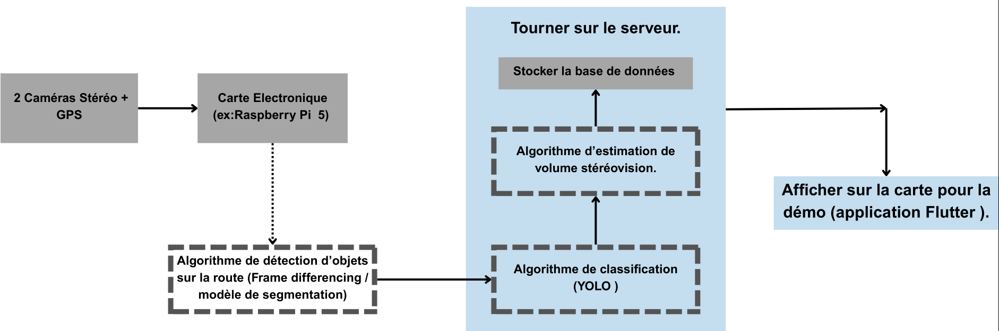
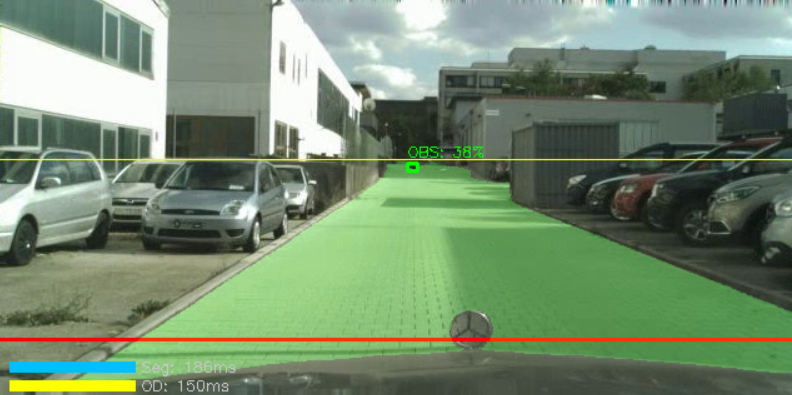
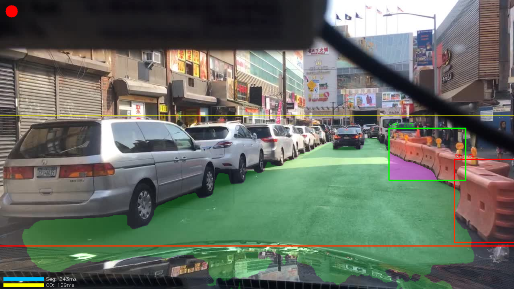
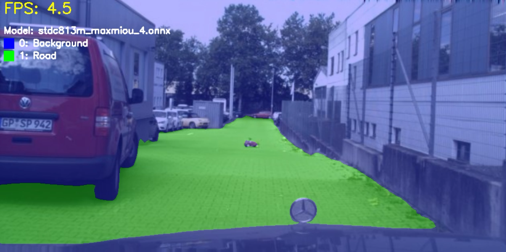
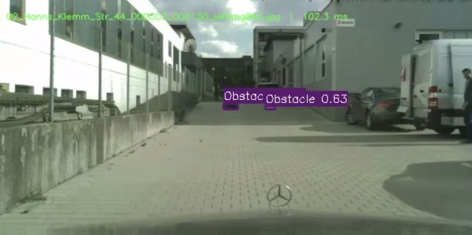
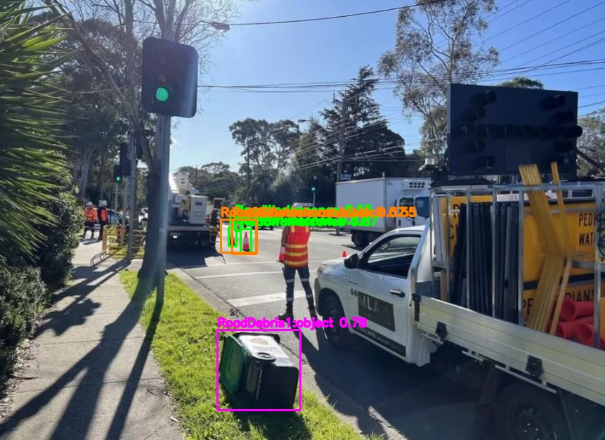
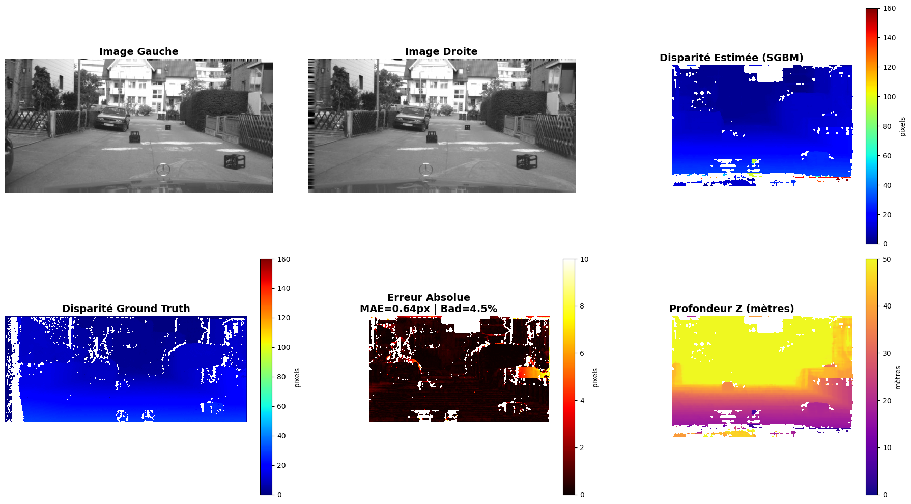

# Vehicle Embedded Obstacle Detection

## Project Overview

This project implements a decentralized, crowd-sourced road safety system similar
to Waze, but automated. The goal is to detect hazardous road obstacles (debris,
fallen logs, rocks) using on-device computer vision in real-time.

This repository focuses on the **Embedded Detection Module**: a lightweight,
power-optimized system running inside the vehicle. It processes a video stream to
filter out "normal" scenery and flags only frames containing verified obstacles
hindering the drivable path. These positive candidates are transmitted to a remote
server for stereo-depth analysis and database updates.

### System Architecture

  

The system operates on a client-server model:

1. **Client (Vehicle)**: Raspberry Pi 5 + stereo cameras + GPS. Runs road
   segmentation and object detection on-device; only flagged frames are uploaded.
2. **Server (Cloud)**: Receives flagged frames, performs heavy computation
   (classification, stereo-depth estimation, traffic impact analysis) and updates
   the central database.
3. **User (App)**: Drivers receive real-time alerts about verified obstacles on
   their route.

📊 The full project presentation is available here:
**[Project Clear Road — Slides (PDF)](./figures/PFE.pdf)**

---

## First Module : Embedded Detection, GPS & Connectivity

### Key Technical Contributions

- **Hybrid Model Architecture**: Dual-model pipeline combining Semantic
  Segmentation (STDC813M) and Object Detection (YOLOv8s).
- **Geometric Sensor Fusion**: Custom algorithm aggregating model outputs, filtering
  false positives (e.g., pedestrians on sidewalks) via the Intersection over Area
  (IoA) between the detected object and the road mask.
- **Edge Optimization**: Quantized models from FP32 to INT8 using the Hailo Dataflow
  Compiler, achieving real-time performance on a Raspberry Pi 5 with a 13 TOPS AI HAT.
- **Dataset Engineering**: Curated a custom "Super Dataset" merging Imad's dataset and
  LostAndFound to correct class imbalances and improve recall on atypical hazards.

#### 1. Hardware Specifications

- **Host**: Raspberry Pi 5 (8 GB RAM)
- **Accelerator**: Hailo-8L AI HAT (13 TOPS, PCIe Gen 3)
- **Sensors**: U-blox GPS (NMEA Sync), Dual Camera (Stereo Capture)
- **Constraints**: High obstacle variety, low latency, strict memory budget,
  optimized power consumption.

#### 2. Detection & Classification Pipeline

The detection logic follows a strict "Filter-then-Flag" approach to minimize bandwidth.

1. **Input**: 640x320 video stream.
2. **Semantic Segmentation (STDC813M)**: Binary mask of the drivable road surface.
   Optimized for speed using the STDC (Short-Term Dense Concatenate) backbone.
3. **Object Detection (YOLOv8s)**: Detects potential hazards. Fine-tuned on a custom
   dataset excluding common traffic objects (cars, signs) to focus on anomalies.
4. **Geometric Fusion (The "Handshake")**:
   - Projects the bounding box onto the segmentation mask.
   - Calculates the overlap percentage.
   - **Decision Rule**: if `Overlap > Threshold` and `Cooldown > 5s`, the frame is
     flagged as a valid hazard.
5. **Output**: Triggers the GPS/Stereo capture routine and saves metadata for transmission.

### Performance & Results

| **Model**               | **Metric** | **Score** | **Notes**                                     |
| ----------------------- | ---------- | --------- | --------------------------------------------- |
| **Segmentation (STDC)** | mIoU@50    | **0.95**  | Fine-tuned on Cityscapes (Road vs Background) |
| **Detection (YOLOv8s)** | mAP@50     | **0.68**  | Custom Dataset (High recall on small debris)  |

**Geometric Fusion in Action**

  
  

*The green bounding box indicates a valid detection overlapping significantly with the
road mask. The system successfully ignores objects outside the drivable area.*

**On-Device Quantized Inference**

  
  

*Left: STDC813M Segmentation (INT8). Right: YOLOv8s Detection (INT8).*

### Development Workflow

Models were trained on an NVIDIA GPU cluster using PyTorch.

- **Segmentation**: Trained on Cityscapes (2-class: Road/Background) to maximize mIoU.
- **Detection**: Trained on a merged dataset (Imad + LostAndFound) to resolve class
  imbalance found in standard datasets like COCO or BDD100K.

**Deployment (Quantization)** — PyTorch (`.pt`) → Hailo Executable Format (`.hef`):

1. **Export**: PyTorch → ONNX (Opset 11).
2. **Calibration**: Post-Training Quantization (PTQ) using 1024 representative images
   to map FP32 weights to INT8 dynamic ranges.
3. **Compilation**: Hailo Dataflow Compiler for graph optimization and resource allocation.

---

## Second Module : Cloud AI Analysis & Classification

This module acts as the high-performance validation engine. It processes flagged data
from the vehicles using specialized server-side models to ensure maximum reliability.

### Key Technical Contributions

- **Backend Infrastructure**: Server-side pipeline to receive, manage and store hazard
  data transmitted from the embedded units.
- **Server-Side Validation**: "Confirm-and-Classify" logic using high-precision YOLOv8
  weights (FP32) to verify detections and eliminate false positives.
- **Multi-Dataset Fine-Tuning**: Integration and training of multiple specialized
  datasets covering a wide range of road hazards.

### 1. Specialized Datasets & Classes

| **Dataset** | **Target Classes** | **Role in the Project** |
| :--- | :--- | :--- |
| **Lost and Found** | Small debris, boxes, scattered objects | Detecting atypical obstacles. |
| **BDD100K** | Stop signs, traffic lights, construction | Validating road infrastructure. |
| **Road Damage** | Potholes, cracks, surface flaws | Identifying surface degradation. |
| **Custom Merged** | Speed bumps, work zones, hybrid hazards | Final multi-class validation. |

### 2. Evaluation Metrics (Server Performance)

| **Model Category** | **mAP@50** | **Precision** | **Recall** | **Status** |
| :--- | :--- | :--- | :--- | :--- |
| **Road Debris (L&F)** | **0.72** | 0.75 | 0.68 | Deployed |
| **Traffic Signs (BDD)** | **0.84** | 0.82 | 0.80 | Deployed |
| **Road Surface** | **0.65** | 0.63 | 0.61 | Deployed |
| **Infrastructure** | **0.78** | 0.76 | 0.74 | Deployed |

  

---

## Third Module : Stereo Depth Estimation

Once a hazard is flagged and confirmed server-side, this module estimates its
**real-world distance and dimensions** from the synchronized stereo pair captured by
the vehicle. This turns a 2D detection into an actionable geolocated hazard
(distance-to-obstacle + estimated size) used downstream for severity scoring.

### Key Technical Contributions

- **Stereo Rig Calibration**: Full intrinsic/extrinsic calibration of the dual-camera
  setup (checkerboard) to recover focal length, principal point, distortion
  coefficients and the stereo baseline (T ≈ 0.80 m).
- **Epipolar Rectification**: Rectified the stereo pair so disparity search reduces to
  a 1D horizontal problem.
- **Disparity Validation & Metric Depth**: Computed disparity with SGBM and validated
  it against ground-truth disparity on the **Lost & Found** test set (MAE = 0.64 px,
  4.5% bad pixels) before converting to metric depth via `Z = f·B / d`. Bounding-box
  geometry is then back-projected at depth `Z` to estimate the obstacle's real-world size.

### Pipeline

1. **Input**: Rectified stereo pair (left/right) + hazard bounding box from Module 1.
2. **Disparity Estimation**: SGBM produces a per-pixel disparity map `d(x, y)`.
3. **Depth Reconstruction**: `Z = (f · B) / d` for each valid pixel.
4. **Obstacle Localization**: Median depth inside the bounding box → robust
   distance-to-hazard (median rejects background/outlier disparities).
5. **Size Estimation**: Bounding-box dimensions back-projected at depth `Z`.

### Validation (Lost & Found test set)

| **Metric**               | **Value**  |
| ------------------------ | ---------- |
| Disparity MAE            | 0.64 px    |
| Bad pixels               | 4.5 %      |
| Depth range (Z)          | 0 – 50 m   |
| Baseline (B)             | ~0.80 m    |

  

*Top: left/right input, estimated disparity (SGBM), and reconstructed depth Z.
Bottom: ground-truth disparity and absolute error map (MAE = 0.64 px, Bad = 4.5%).
The low error confirms the disparity is reliable enough for metric depth estimation.*

---
